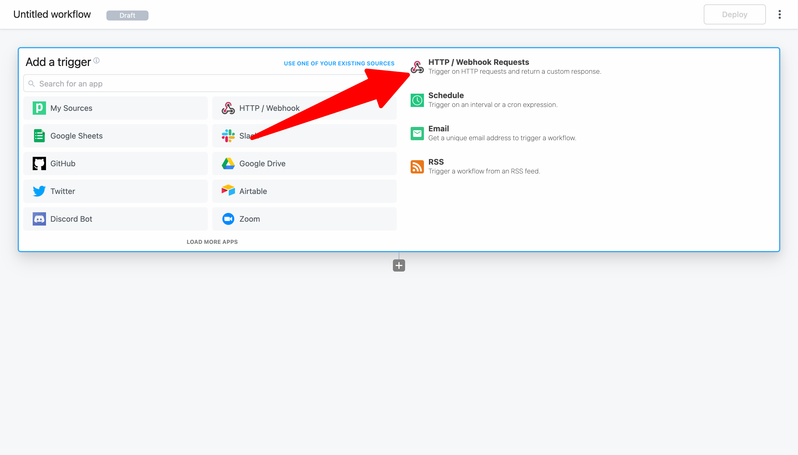
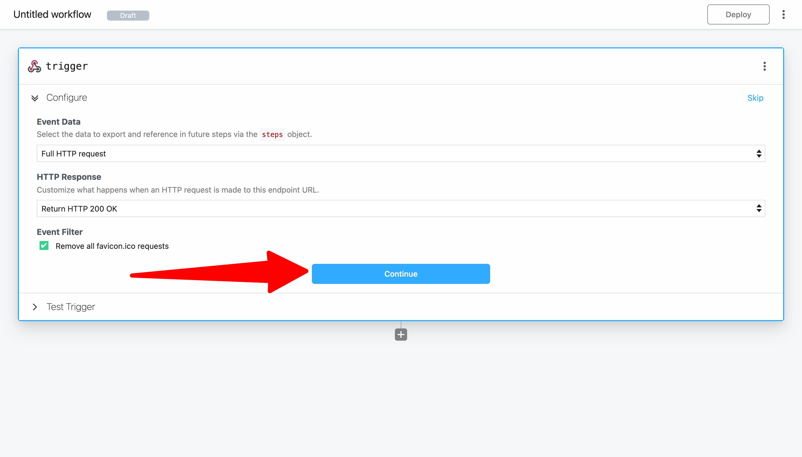
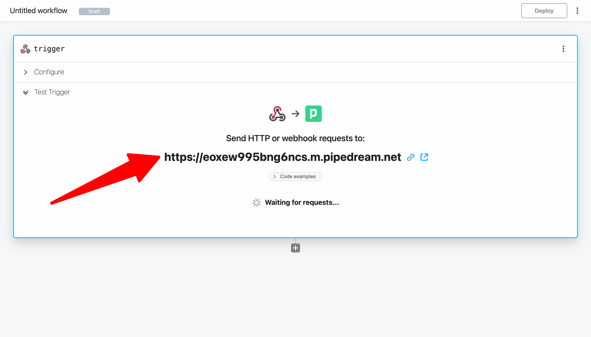
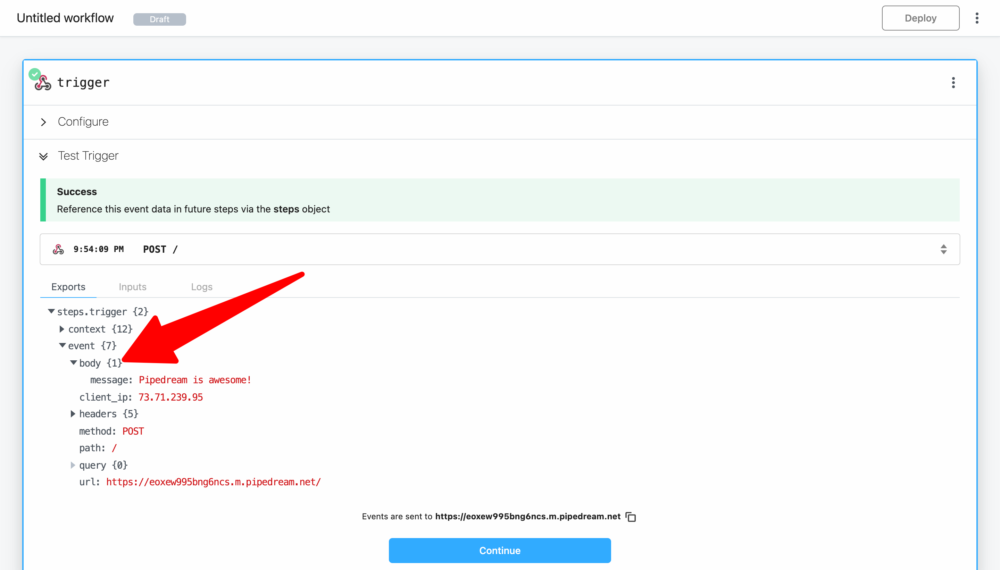
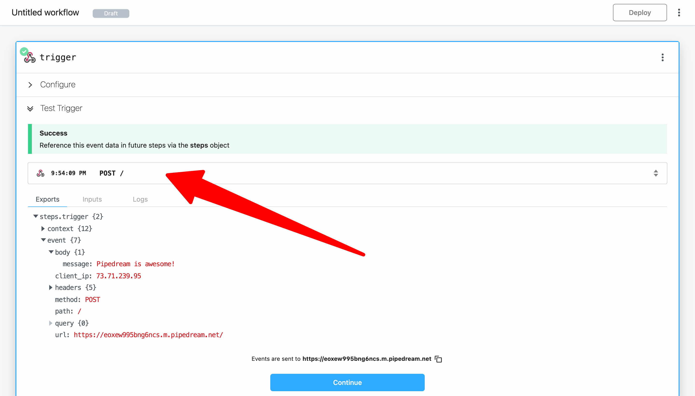
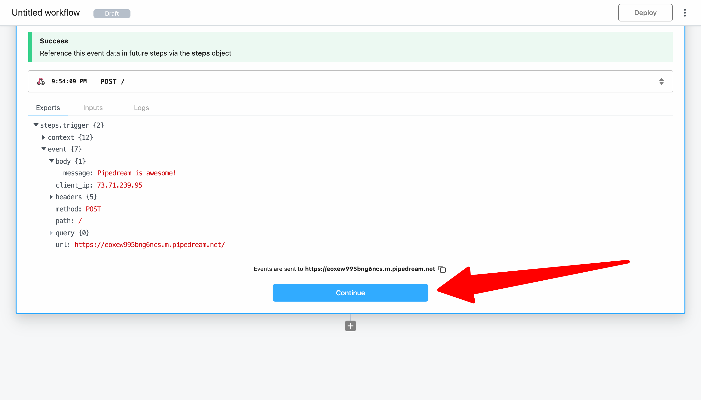
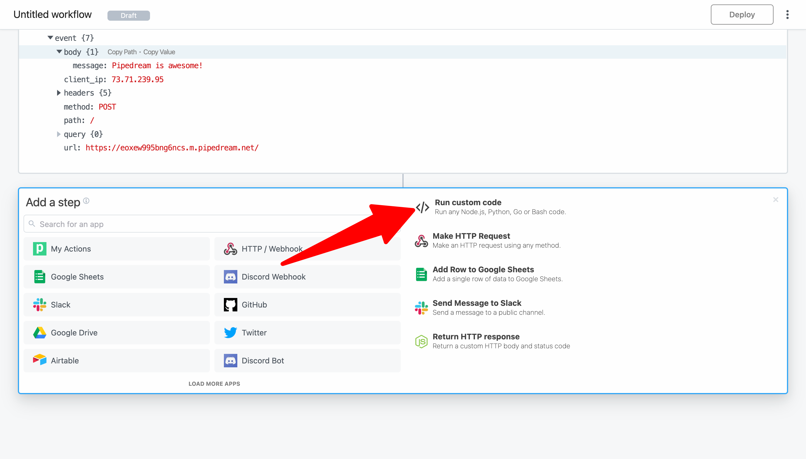
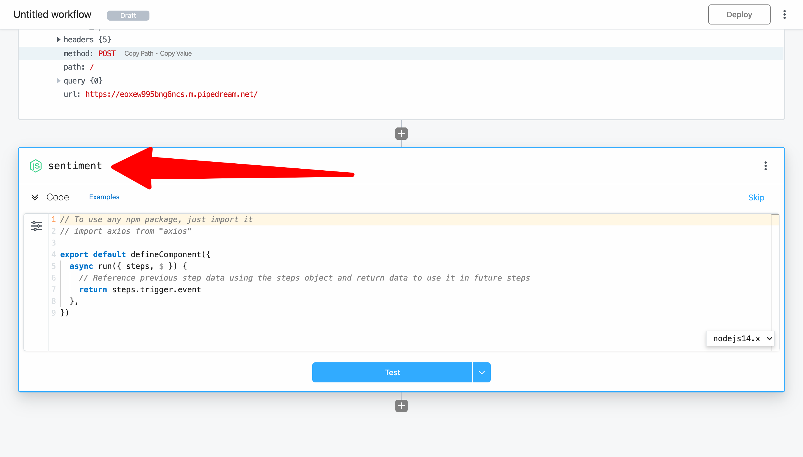
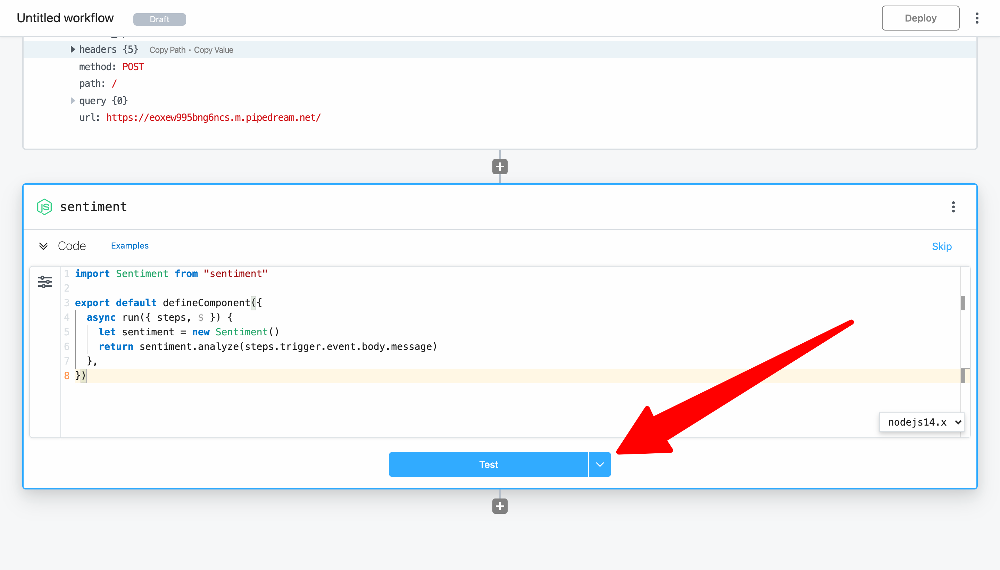
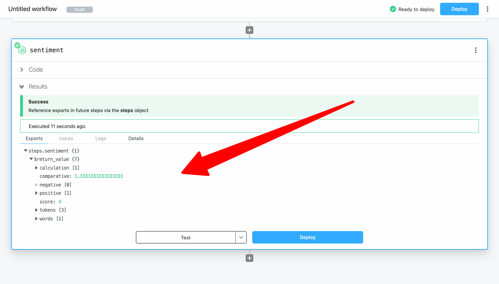

# Quickstart

Sign up for a [free Pipedream account (no credit card required)](https://pipedream.com/auth/signup) and complete this quickstart guide to learn the basic patterns for workflow development:

[[toc]]

### Create a new workflow

First, create a new workflow by clicking **New** from [https://pipedream.com/workflows](https://pipedream.com/workflows):


### Add an HTTP / Webhook trigger

Pipedream will launch the workflow builder. For this example, select the **HTTP / Webhook Requests** trigger. 



Click **Continue** to accept the default settings.



Pipedream will generate a unique URL to trigger this workflow.



### Send data to the workflow

Next, send data to the trigger URL to help you build the workflow. For this example, send an HTTP POST request with a JSON body containing a simple message.

```json
{
  "message": "Pipedream is awesome!"
}
```

You can edit and run the following cURL command or use your favorite app (like Postman or Hoppscotch).

```bash
curl -d '{
  "message": "Pipedream is awesome!"
}'   -H "Content-Type: application/json"   YOUR-TRIGGER-URL-GOES-HERE
```

When Pipedream receives the request, it will display the contents of the HTTP request. Expand the `body` to validate that the message was received. 

If you need to send a different event to your workflow you can select it from the event selector:



::: tip

The selected event will be used to provide autocomplete suggestion as you build your workflow. The data will also be used when testing later steps.

:::

### Enrich trigger data using Node.js and npm

Before we send data to Google Sheets, let's use the npm [`sentiment`](https://www.npmjs.com/package/sentiment) package to generate a sentiment score for our message. To do that, click **Continue** or the **+** button.



That will open the **Add a step** menu. Select **Run custom code**.

 

Pipedream will add a Node.js code step. Rename the step to **sentiment**.

 

Next, add the following code to the code step:

```javascript
import Sentiment from "sentiment"

export default defineComponent({
  async run({ steps, $ }) {
    let sentiment = new Sentiment()
    return sentiment.analyze(steps.trigger.event.body.message)
  },
})
```

This code imports the npm package, passes the message we sent to our trigger to the `analyze()` function by referencing `steps.trigger.event.body.message` and then returns the result. 

::: tip

To use any npm package on Pipedream, just `import` it. There's no `npm install` or `package.json` required.

:::

::: tip

Any data you `return`  from a step is exported so it can be inspected and referenceed it in future steps via the `steps` object. In this example, return values will be exported to `steps.sentiment.$return_value` because we renamed the step to **sentiment** .

::: 

Your code step should now look like this. To run the step and test the code, click the **Test** button.



You should see the results of the sentiment analysis when the test is complete.



::: tip

When you **Test** a step, only the current step is executed. Use the caret to test different ranges of steps including the entire workflow.

::: 

### Save data to Google Sheets
